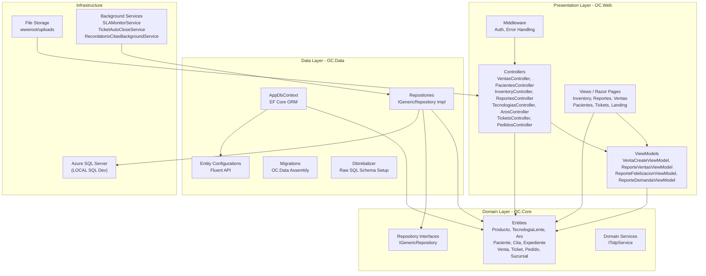
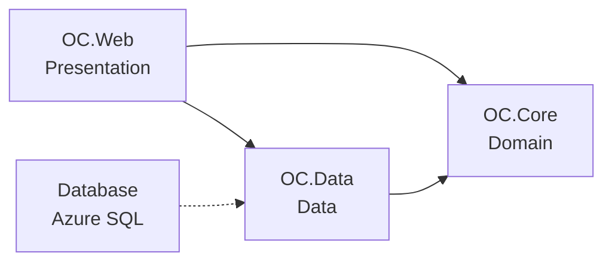
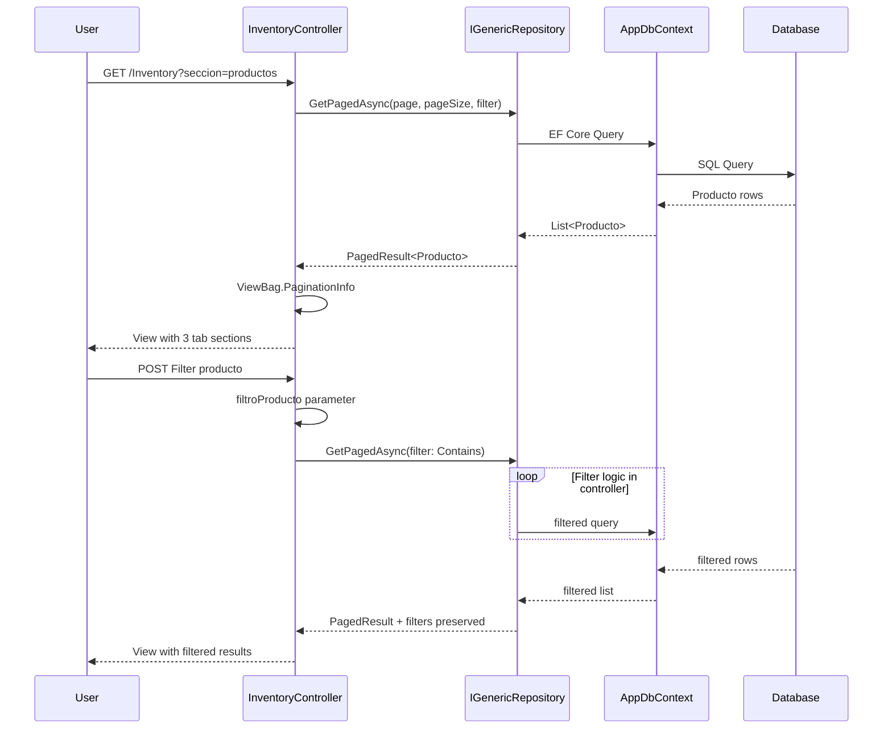
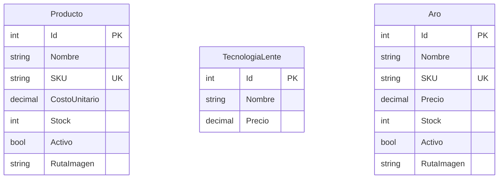

# Óptica Comunal - Architecture Diagram

## System Overview



## Layer Dependencies



## Key Entity Relationships

```mermaid
erDiagram
    Producto {
        int Id PK
        string Nombre
        string SKU
        decimal CostoUnitario
        int Stock
        bool Activo
        string RutaImagen
    }
    TecnologiaLente {
        int Id PK
        string Nombre
        decimal Precio
    }
    Aro {
        int Id PK
        string Nombre
        string SKU UK
        decimal Precio
        int Stock
        bool Activo
        string RutaImagen
    }
    Venta {
        int Id PK
        int ProductoId FK
        decimal Subtotal
        decimal Descuento
        decimal Total
        string MetodoPago
        string ReferenciaPago
        string RutaComprobante
        int? TecnologiaLenteId FK
        int? AroId FK
    }
    Paciente {
        int Id PK
        string Nombre
        string Cedula
        string Email
        string Telefono
    }
    Cita {
        int Id PK
        int PacienteId FK
        int? ExpedienteId FK
        string Estado
        DateTime FechaHora
    }
    Expediente {
        int Id PK
        int CitaId UK
        string Observaciones
    }
    Sucursal {
        int Id PK
        string Nombre
        string Ubicacion
    }
    Ticket {
        int Id PK
        int? PacienteId FK
        int? SucursalId FK
        string Asunto
        string Estado
    }
    Pedido {
        int Id PK
        int? ProveedorId FK
        DateTime Fecha
        string Estado
    }
    Producto ||--o| Venta : " FK"
    TecnologiaLente ||--o| Venta : " FK"
    Aro ||--o| Venta : " FK"
    Paciente ||--o| Cita : " FK"
    Cita ||--o| Expediente : " 1:1 via CitaId"
```

## Request Flow - Inventory Feature



## Project Structure

```
OC.Solution/
├── OC.Core/                    # Domain Layer (no dependencies)
│   ├── Domain/
│   │   └── Entities/           # Producto, TecnologiaLente, Aro, Venta, etc.
│   ├── Contracts/
│   │   └── IRepositories/     # IGenericRepository<T>
│   └── Services/               # ITotpService
│
├── OC.Data/                    # Data Layer (depends on OC.Core)
│   ├── Context/
│   │   ├── AppDbContext.cs     # EF Core DbContext
│   │   └── DbInitializer.cs     # Raw SQL schema setup
│   ├── Repositories/           # IGenericRepository implementations
│   ├── Configurations/          # Fluent API entity configs
│   └── Migrations/             # EF Migrations assembly
│
├── OC.Web/                     # Presentation Layer (depends on Core + Data)
│   ├── Controllers/            # MVC Controllers
│   ├── Views/
│   │   ├── Inventory/          # Consolidated inventory tabs
│   │   ├── Reportes/           # Ventas, Fidelizacion, Demanda
│   │   ├── Ventas/
│   │   ├── Pacientes/
│   │   └── Landing/
│   ├── ViewModels/
│   ├── wwwroot/
│   │   ├── css/
│   │   ├── uploads/            # Producto, Aro, Comprobante images
│   │   └── js/
│   ├── Program.cs              # DI, Middleware, Background Services
│   └── appsettings.json
│
└── CLAUDE.md
```

## Database Schema (Key Tables)

